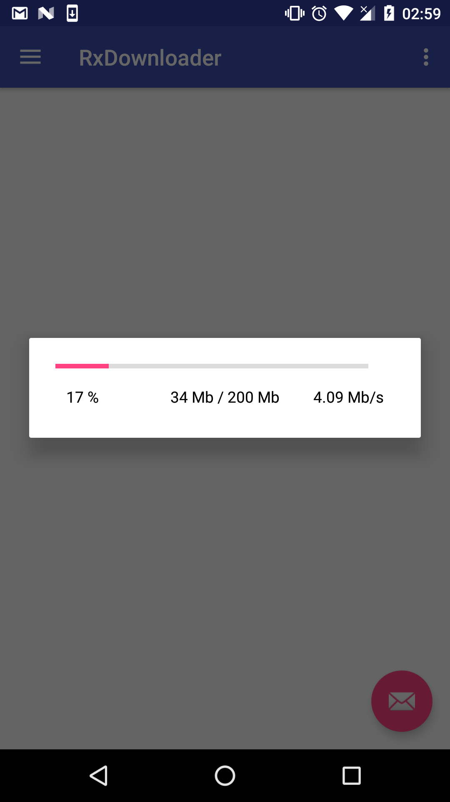

# RxTransfer
Never been this easy to download a file while tracking downloading progress! 

**RxTransfer** transparently handles the following tasks : 
- asking the user for **writing permissions** if the device requires runtime permissions handling
- creating destination file if not existing
- downloading the file from the url in a background thread 
- showing error message on error 
- showing message on successfull download
- exposing progress in different ways 
- handling orientation change 
- handle **backPressed**: download is not stop if not desired (**backPressed** listener soon coming)

## Usage
Here's the different ways in which **download progress** can be tracked:
- within a `ProgressDialog` fragment 

<table>
    <tr>
        <td>
           <pre lang="java">
            new RxDownload()
                .activity(this)
                .saveTo(path)
                .url(url)
                .showDialog() // Show Dialog fragment including ProgressBar
                .completedMessage("Operation Completed", mLayout)
                .start();
           </pre>
        </td>
        <td>
            
        </td>
    </tr>
</table>

- within your own `ProgressBar` instance 

```java
new RxDownload()
    .activity(this)
    .saveTo(path)
    .progressInto(progress) // Provide ProgressBar instance
    .url(url)
    .start();
``` 

- Provide a Listener to track the progress

```java
new RxDownload()
    .activity(this)
    .saveTo(path)
    .listener(progress -> { // Update your progress bar through the listener
        progressBar.setProgress(progress);

        if(progress == 100)
            DialogBuilder.showMessage("Operation Completed", mLayout);
    })
    .url(url)
    .start();
```


## Setup
Add the JitPack repository in your build.gradle (top level module):

```gradle
allprojects {
    repositories {
        jcenter()
        maven { url "https://jitpack.io" }
    }
}
```

And add next dependencies in the build.gradle of the module:

```gradle
dependencies {
    compile 'com.github.MattiaPrimavera:RxTransfer:0.16'
}
```

## Samples 
Look [here](https://github.com/MattiaPrimavera/RxTransfer/tree/master/app/src/main/java/mprimavera/rxdownloader) for Samples

## Soon coming
- RxUpload class
- propose a set of default UI widgets to directly include within the layout
- retry policies on error : restart download automatically / restart button
- cancel download
- stop / resume download

## Contributions / Feature requests
Feel free to open an **issue** to propose a feature request or a **pull request** if you wanna contribute ;)

## Medium
**Medium** article introducing the library can be found [here](https://medium.com/@sconqua/rxtransfer-track-http-download-android-96b27411a573)
